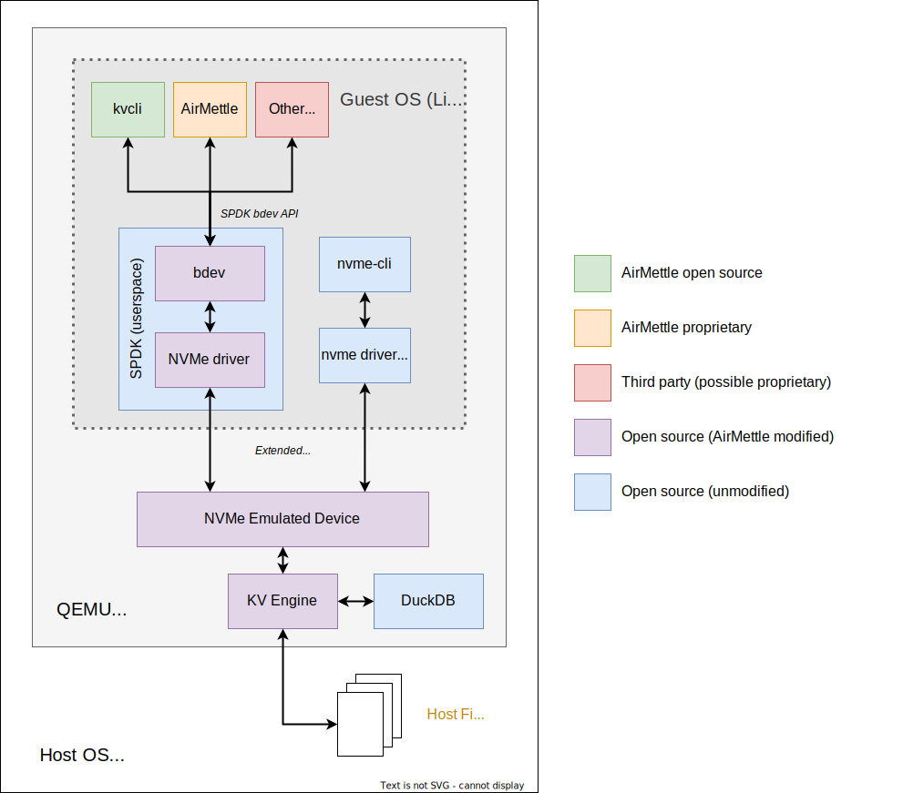

# Design Diagram

This document provides an overview of the components of the CSD project and how they interact through a design diagram. It also offers detailed insight from two different perspectives: the Host OS and the Guest OS.

## Table of Contents

- [Design Diagram](#design-diagram)
- [Host OS](#host-os)
  - [Emulator software](#emulator-software)
  - [Modifications to the QEMU NVMe Emulator](#modifications-to-the-qemu-nvme-emulator)
    - [Added handlers to the QEMU NVMe controller](#added-handlers-to-the-qemu-nvme-controller)
    - [Added functions to store, retrieve, list, and delete KV objects](#added-functions-to-store-retrieve-list-and-delete-kv-objects)
    - [Added function to support select queries on the KV objects](#added-function-to-support-select-queries-on-the-kv-objects)
- [Guest OS](#guest-os)
  - [Tools on the Guest OS](#tools-on-the-guest-os)
    - [NVMe CLI](#nvme-cli)
    - [SPDK](#spdk)
    - [SPDK client apps](#spdk-client-apps)

## Design Diagram

The following diagram outlines the components of the project:



## Host OS

The Host OS is where the emulator software is run.

### Emulator software

We are using the open source QEMU project. QEMU is a user space program that is both an emulator and a virtualizer. It allows you to run virtual machines and emulate devices such as NVMe drives that the virtual machines can then use. QEMU compiles to a binary that you can then run against an `.iso` or file image to start and run a virtual machine.

The virtual machine can be a different operating system than the Host OS. For example, we run QEMU on the MacOS host and the virtual machine it runs is an Ubuntu Linux OS.

The virtual machine it runs is called the Guest OS. The Guest OS has full access to a network stack so it can communicate with other virtual machines.

### Modifications to the QEMU NVMe Emulator

QEMU contains code for emulating NVMe drives. The Guest OS can use that NVMe drive just as it would if it was a real device. We modified the NVMe emulator code in QEMU to add new commands. These are represented by NVMe opcodes. The new commands are used to provide Key Value (KV) functionality for NVMe clients. The KV store, retrieve, list, exists, delete functionality is based on the existing NVMe KV Specification which is part of the NVMe 2.0 specification. We defined a new specification for the query commands since those are not in the 2.0 specification.

We made the following modifications to QEMU to support the KV commands:

#### Added handlers to the QEMU NVMe controller

We added handlers to the QEMU NVMe controller code to support the new NVMe KV commands. These handlers use a thread pool and communicate with the QEMU main loop. This makes sure all KV queries are non-blocking and don't affect other functionalities running in the virtual machine.

#### Added functions to store, retrieve, list, and delete KV objects

This uses the Host OS filesystem to create and handle the objects. Objects are treated as files and written to the host filesystem.

For example, for a object name "B", it is written to the filesystem in file `./0/1/66` where:

- `0` is the `pci_bus_number`,
- `1` is the `namespace_id`, and
- `66` is the object name, "B", in hexidecimal.

The object name is stored in hexidecimal since binary object names are supported. Object names can be binary but must be 16 bytes or less per the NVMe KV specification.

#### Added function to support select queries on the KV objects

This uses the open source DuckDB project which we embedded in the QEMU emulator. It loads the files from the filesystem and runs them through the query engine. It supports CSV, JSON, and Parquet files.

## Guest OS

The Guest OS is running the virtual machine inside the QEMU emulator/virtualizer. In our case, we run Ubuntu 22 Linux. Once Ubuntu is running, we are able to install and compile various tools to use the NVMe emulator. These tools do not know the difference between an emulator and a real device so once there are real NVMe KV devices that support the specification, they would work on them as well.

### Tools on the Guest OS

#### NVMe CLI

The open source `nvme` tool allows communication with NVMe drives through the Linux kernel. It includes support for passing through any IO commands. This allowed us to use it to test the new NVMe KV commands without modifying the NVMe CLI source code.

For example, the following command sends a command with opcode `0x81` which is the one to store a KV file:

```bash
nvme io-passthru /dev/nvme0 --opcode=0x81
```

#### SPDK

SPDK is a client library that lets you communicate with NVMe drives using a user space polling driver instead of going through the Linux kernel. This allows for better performance.

We modified these components of SPDK to add APIs for the new NVMe KV commands:

- **NVMe driver** - support for the new commands were added the the SPDK NVMe user space driver
- **bdev** - `bdev` is an API and library SPDK clients can use to communicate with block devices - other devices besides NVMe are supported since it is the generic layer. We chose to extend bdev rather than creating a new SPDK library since it would allow clients to use existing the SPDK async events and channel framework bdev already uses.
- **bdev-nvme** - `bdev-nvme` is the handler for bdev commands to use the NVMe driver. For the new KV commands that were added into the bdev layer, we added the implementation of them in bdev-nvme so they call the the SPDK nvme driver which will then send the commands to the NVMe device/emulator.

#### SPDK client apps

With the new bdev KV API we created in SPDK, we modified and created code to use it to test and demonstrate the new KV API. These tools all call the bdev API in SPDK which call the SPDK NVMe driver which sends the command to the NVMe emulator which calls the new KV code we added to QEMU.

- **KV CLI** - This is a command line tool we wrote that lets you run all of the new KV commands to upload, download, and run queries on files. It allows for integration testing scripts to be created.
- **AirMOS** - This is the AirMettle object storage. It is being modified to use NVMe KV devices to store and query objects for a node rather than using its own internal engine.
